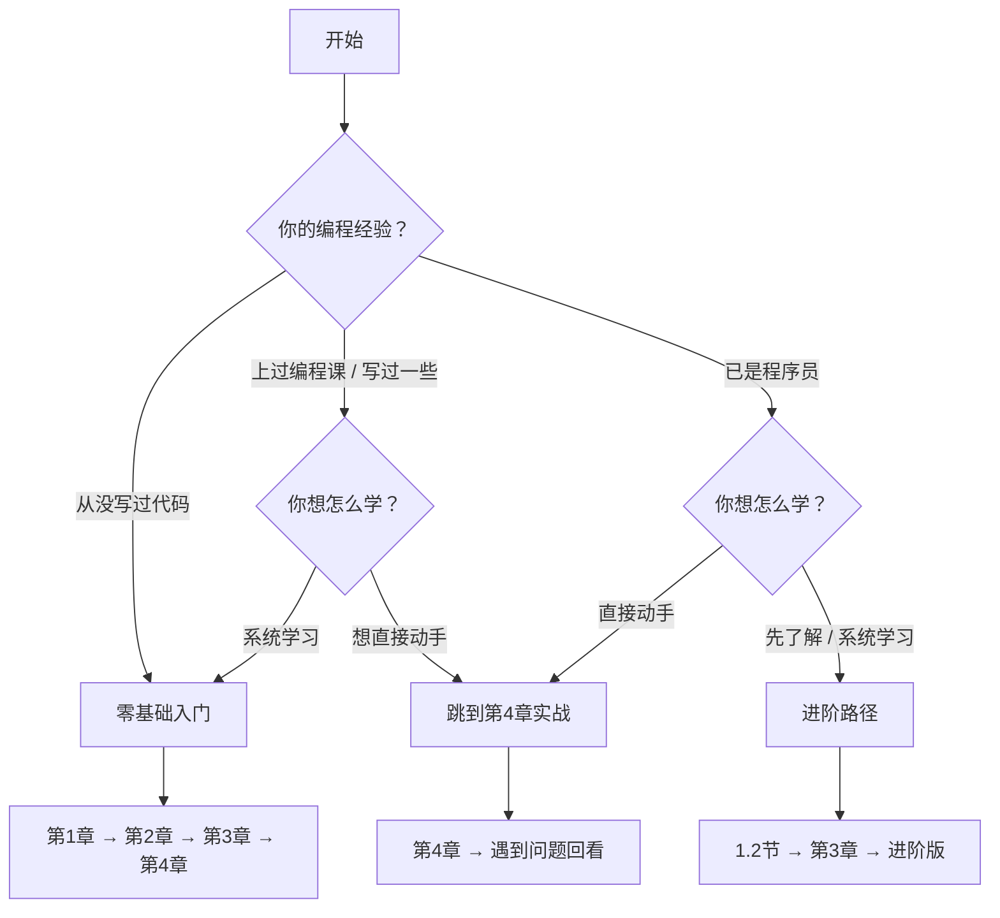

# 自测清单：你应该从哪里开始？

不同的人，起点不同。花 1 分钟回答两个问题，找到最适合的学习路径。

## 一图看懂你的学习路径

如果流程图看不清，也可以回答下面两个问题来确定。

## 先问自己两个问题

**问题 1：你的编程经验？**

| 选项 | 描述 |
|------|------|
| **A** | 从没写过代码，或只是用过 ChatGPT/Claude 聊天 |
| **B** | 上过编程课 / 写过一些代码，但没做过完整项目 |
| **C** | 已经是程序员，会写代码 |

**问题 2：你现在最想做什么？**

| 选项 | 描述 |
|------|------|
| **1** | 先了解这是什么，不急着动手 |
| **2** | 想直接做出点东西，边做边学 |
| **3** | 系统学习，打好基础 |

## 对号入座

### 选了 A + 任意 → 零基础入门

**特征**：从没写过代码，对编程一无所知；或者用过 AI 聊天，但没用它们做过实际项目

**建议路径**：
1. 从 [第 1 章：觉醒](/Basic/01-awakening/) 开始，建立基本认知
2. 重点学习 [第 2 章：心法](/Basic/02-mindset/) 和 [第 3 章：技法](/Basic/03-technique/)
3. 跟着 [第 4 章：实战](/Basic/04-practice-0-to-1/) 做出第一个作品

**预计时长**：4-8 小时（可分 2-4 天完成）

### 选了 B/C + 2 → 想直接动手

**特征**：不想看太多理论，想先做出东西再说

**建议路径**：
1. 直接跳到 [第 4 章：实战](/Basic/04-practice-0-to-1/)
2. 遇到问题时，回看对应的概念章节
3. 做完项目后，补看 [第 2 章](/Basic/02-mindset/) 加深理解

**预计时长**：2-3 小时（快速版）

### 选了 C + 1/3 → 已有编程基础

**特征**：会写代码，想学习如何与 AI 协作

**建议路径**：
1. 浏览 [第 1.2 节](/Basic/01-awakening/1.2-vibe-vs-spec/) 理解 Vibe Coding vs Spec Coding
2. 学习 [第 3 章](/Basic/03-technique/) 提升与 AI 协作的效率
3. 完成基础版后，直接进入 [进阶版教程](/Advanced/)

**预计时长**：2-4 小时（基础版）+ 进阶版学习

## 不确定选哪个？

没关系。推荐从 [第 1 章：觉醒](/Basic/01-awakening/) 开始，如果觉得内容太基础，随时可以跳到后面章节。

不管选择哪条路径，都建议完整做一遍 [第 4 章](/Basic/04-practice-0-to-1/) 的实战项目——理论再多，不如亲手做一次。

## 下一步

确认了起点，现在去看看 [学完这份教程，将获得什么](./0.3-outcomes.md)，把目标定清楚。
