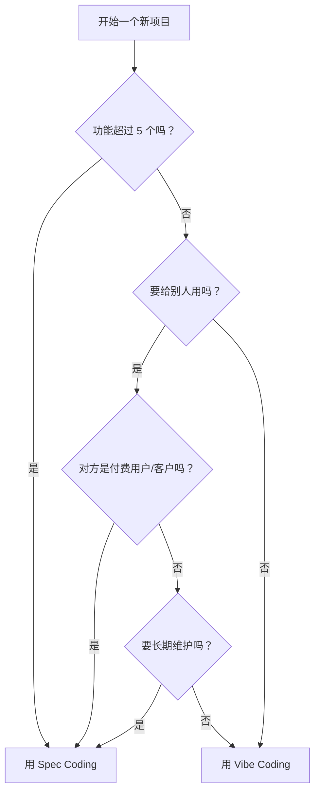

# 1.2.3 Vibe vs Spec：什么时候用什么

学完了 Vibe Coding 和 Spec Coding，下一个问题是：项目到底该用哪个？

这一节提供一个简单的决策框架。

## 三个问题快速判断

在开始一个项目前，问自己三个问题：

| 问题 | 需要 Spec 的信号 |
|------|-----------------|
| **功能数量** | 超过 5 个功能 |
| **使用者** | 给客户/团队用 |
| **时长** | 需要长期维护 |

**判断规则**：如果有 2 个以上回答"需要 Spec"，就用 Spec Coding；否则 Vibe Coding 即可。

## 决策流程图

**简单记：小项目、自己用、短期使用 → Vibe；大项目、给别人、长期维护 → Spec。**

## 混合使用：最佳实践

实际工作中，你不需要非此即彼。很多时候，混合使用效果最好。

### 模式 1：Vibe 起步，Spec 收尾

**适合场景**：你有个想法，不确定能不能做出来。

**流程**：
1. 先用 Vibe Coding 快速做个最小原型
2. 验证想法可行后，暂停写代码
3. 补上需求文档和任务清单
4. 后续开发用 Spec Coding 方式

**好处**：不会在一个不靠谱的想法上浪费时间写文档。

### 模式 2：Spec 规划，Vibe 执行

**适合场景**：你很清楚要做什么，只是需要 AI 帮你快速实现。

**流程**：
1. 先花 10 分钟写个简单的需求清单
2. 把清单分成小任务
3. 每个小任务用 Vibe Coding 快速完成
4. 完成后检查是否符合需求

**好处**：既有方向感，执行又快。

### 模式 3：渐进式演进

**适合场景**：项目会逐渐变大，一开始不知道会发展成什么样。

**流程**：
1. 第一版：纯 Vibe，快速上线
2. 开始有用户反馈，功能变多：补上简单文档
3. 用户越来越多，需要稳定：正式用 Spec 方式管理

**好处**：按需投入，不过度设计。

## 实际案例

### 案例 1：做一个番茄钟小工具

**分析**：
- 功能：倒计时 + 开始/暂停 + 提醒 = 3 个功能
- 使用者：自己
- 时长：用几周就可能换别的

**决定**：Vibe Coding

**Prompt 示例**：
> "帮我做一个番茄钟网页，25 分钟倒计时，有开始、暂停、重置按钮，时间到了弹窗提醒。"

### 案例 2：做一个团队内部的日报系统

**分析**：
- 功能：写日报 + 查看历史 + 按人筛选 + 按日期筛选 + 导出 + 统计 = 6 个功能
- 使用者：团队 10 个人
- 时长：长期使用

**决定**：Spec Coding

**第一步**：先写需求文档
> "帮我写一份'团队日报系统'的需求文档，包括产品概述、目标用户、核心功能（写日报、查看历史、按人筛选、按日期筛选、导出、统计）和不做什么。"

### 案例 3：验证一个创业想法

**分析**：
- 想法：一个帮人匹配学习伙伴的平台
- 不确定能不能做出来
- 不确定有没有人用

**决定**：先 Vibe，再看情况

**流程**：
1. 用 Vibe Coding 做一个最简单的版本（只有填表单 + 看匹配结果）
2. 发给 10 个朋友试用
3. 如果反馈好，再补文档、做完整版

## 记住一句话

> **先开始，再完善。**

不要在"用 Vibe 还是 Spec"上纠结太久。如果纠结，就先 Vibe 起来；做着做着发现乱了，再停下来补文档。这本身就是一种学习过程。没有人第一次就选对，重要的是**开始**。

## 快速检查清单

开始项目前，花 30 秒过一遍：功能超过 5 个吗？要给别人用吗？要长期维护吗？

**如果有 2 个以上回答"是"，建议用 Spec Coding；否则 Vibe Coding 即可。**

::: info 小结
- 小项目、自己用、短期使用 → Vibe Coding
- 大项目、给别人、长期用 → Spec Coding
- 可以混合使用：Vibe 起步 + Spec 收尾 是常见模式
- 不要纠结，先开始，做着再调整
:::

下一节，我们来学习一些 AI 编程中必须知道的[核心概念](./1.2.4-other-concepts.md)：Prompt、Context、Token 等。
