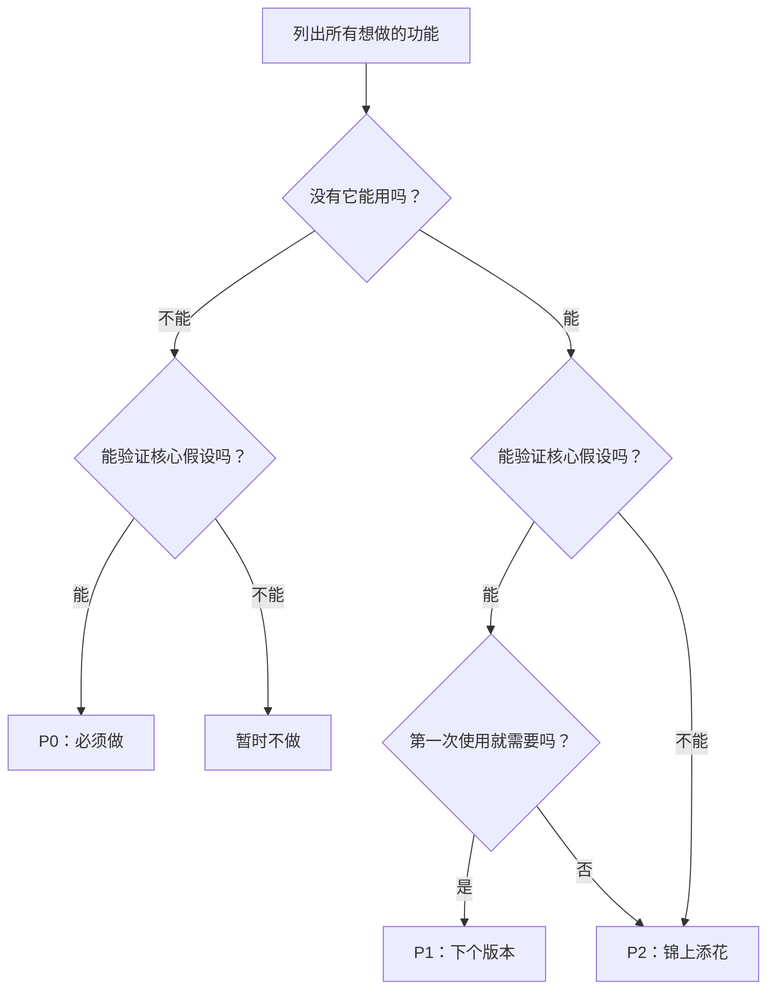

# 2.3.4 如何从 20 个功能砍到 3 个

理解了 MVP 的含义，下一个问题是：具体怎么做减法？

本节提供一套可操作的方法。


## 砍功能的三个灵魂问题

面对每一个功能，问自己这三个问题：

### 问题 1：没有这个功能，产品还能用吗？

这个问题帮你区分「核心功能」和「附加功能」。

**判断标准**：
- 如果答案是「能」→ 这个功能不是核心功能
- 如果答案是「不能」→ 这可能是核心功能

**待办清单的例子**：
| 功能 | 没有它能用吗？ | 结论 |
|-----|--------------|------|
| 添加任务 | 不能 | 核心功能 |
| 完成任务 | 不能 | 核心功能 |
| 查看任务列表 | 不能 | 核心功能 |
| 任务分类 | 能（先不分类也行） | 非核心 |
| 暗黑模式 | 能（不影响使用） | 非核心 |
| 统计报表 | 能（知道完成了就行） | 非核心 |


### 问题 2：这个功能能验证我的核心假设吗？

这个问题帮你聚焦于验证假设的功能。

**判断标准**：
- 如果答案是「能」→ 考虑保留
- 如果答案是「不能」→ 暂时不做

**待办清单的例子**：

假设核心假设是：「极简待办比便签纸更容易坚持」

| 功能 | 能验证假设吗？ | 理由 |
|-----|--------------|------|
| 一键添加任务 | 能 | 测试「极简」是否真的更容易用 |
| 打卡日历 | 不确定 | 可能有用，但不是验证「极简」的关键 |
| 社交分享 | 不能 | 这是增长功能，不是验证功能 |
| 成就系统 | 不能 | 这是留存功能，先验证核心价值再说 |


### 问题 3：用户第一次使用就需要这个功能吗？

这个问题帮你区分「获客功能」和「留存功能」。

**判断标准**：
- 第一次使用就需要 → 可能是 P0
- 用了一段时间才需要 → 可能是 P1
- 锦上添花 → 可能是 P2

**关键洞见**：
- 新用户只关心「这个东西能帮我做什么」
- 排行榜、成就系统、社交功能是让用户「留下来」的，不是让用户「进来」的
- MVP 阶段应该聚焦于让用户「进来并体验核心价值」


## P0/P1/P2 优先级框架

用三个问题筛选后，把功能分成三档：

| 优先级 | 定义 | 行动 | 示例 |
|-------|------|------|------|
| **P0** | 没有就无法验证核心价值 | 必须在 MVP 中包含 | 添加任务、完成任务 |
| **P1** | 重要但可以后续迭代 | V2 版本再做 | 任务分类、提醒功能 |
| **P2** | 锦上添花 | 有时间再说 | 暗黑模式、统计报表 |

**原则**：
- P0 功能不超过 3-5 个
- 如果 P0 超过 5 个，说明你还没想清楚核心价值是什么
- P1 和 P2 写下来但暂时不做，防止忘记也防止诱惑


## 砍功能决策树

把上面的方法整理成一个决策流程：




## AI 辅助：让 AI 帮你砍功能

你可以直接把功能列表交给 AI，让它帮你做优先级分析。

### Prompt 模板

```markdown
我正在做一个项目：[项目描述]

目标用户是：[用户描述]

我的核心假设是：[假设描述]

我目前规划了这些功能：
1. [功能1]
2. [功能2]
3. [功能3]
...

请帮我分析：
1. 哪些是 P0 核心功能（没有就不能验证假设）
2. 哪些是 P1 可以后续迭代的功能
3. 哪些是 P2 锦上添花可以先砍掉的功能

请给出分类理由。
```

### 示例：待办清单项目

```markdown
我正在做一个项目：帮助职场人士管理每日待办事项

目标用户是：25-35岁职场人士，每天有5-10个待办事项需要管理

我的核心假设是：人们不用复杂的待办工具，是因为太麻烦；
如果有一个极简的工具，他们会更愿意用

我目前规划了这些功能：
1. 添加任务
2. 完成任务（打勾）
3. 查看今日任务
4. 任务分类
5. 优先级标签
6. 截止日期提醒
7. 重复任务
8. 子任务拆解
9. 日历视图
10. 统计报表
11. 多设备同步
12. 暗黑模式

请帮我分析优先级。
```

### AI 可能的回复

```
基于你的核心假设「极简更容易坚持」，我的分析如下：

**P0（核心功能，必须有）**：
1. 添加任务 - 最基础的功能
2. 完成任务 - 验证「用起来」的闭环
3. 查看今日任务 - 知道今天要做什么

理由：这三个功能构成最小闭环，可以验证用户是否愿意用极简工具

**P1（下个版本）**：
4. 截止日期提醒 - 有价值，但可以先手动记
5. 任务分类 - 任务多了才需要

**P2（暂时不做）**：
6-12 全部。理由：
- 优先级标签、子任务：增加复杂度，与「极简」假设矛盾
- 日历视图、统计报表：是「高级功能」，不是核心价值
- 多设备同步：需要后端，大大增加开发复杂度
- 暗黑模式：纯粹美化，不影响核心验证

建议 MVP 只做前 3 个功能。
```


## 实战演练：为待办清单做减法

让我们用这套方法，为小李的项目做一次完整的减法：

### 原始功能清单（14 个）

1. 任务分类
2. 优先级标签
3. 截止日期提醒
4. 重复任务
5. 子任务拆解
6. 标签系统
7. 日历视图
8. 看板视图
9. 统计报表
10. 多设备同步
11. 团队协作
12. 评论功能
13. 暗黑模式
14. 桌面小组件

### 核心假设

> 职场人士愿意用一个极简工具管理待办，因为它比复杂工具更容易坚持。

### 应用三个问题

| 功能 | Q1：没有能用？ | Q2：验证假设？ | Q3：首次需要？ | 优先级 |
|-----|--------------|--------------|--------------|-------|
| 添加任务 | 不能 | 能 | 是 | **P0** |
| 完成任务 | 不能 | 能 | 是 | **P0** |
| 查看任务 | 不能 | 能 | 是 | **P0** |
| 任务分类 | 能 | 不确定 | 不一定 | P1 |
| 优先级标签 | 能 | 否（增加复杂度） | 否 | P2 |
| 截止日期提醒 | 能 | 部分 | 不一定 | P1 |
| 重复任务 | 能 | 否 | 否 | P2 |
| 子任务拆解 | 能 | 否 | 否 | P2 |
| 标签系统 | 能 | 否 | 否 | P2 |
| 日历视图 | 能 | 否 | 否 | P2 |
| 看板视图 | 能 | 否 | 否 | P2 |
| 统计报表 | 能 | 否 | 否 | P2 |
| 多设备同步 | 能 | 否 | 否 | P2 |
| 团队协作 | 能 | 否 | 否 | P2 |
| 评论功能 | 能 | 否 | 否 | P2 |
| 暗黑模式 | 能 | 否 | 否 | P2 |
| 桌面小组件 | 能 | 否 | 否 | P2 |

### 结论

**P0（MVP 必须有）**：3 个
- 添加任务
- 完成任务
- 查看今日任务

**P1（下个版本）**：2 个
- 任务分类
- 截止日期提醒

**P2（暂不做）**：12 个
- 其他全部

从 14 个功能砍到 3 个。这就是减法。


## 本节要点

你现在掌握了具体的砍功能方法：

- 三个灵魂问题帮你快速判断功能优先级
- P0/P1/P2 框架帮你结构化思考
- AI 可以辅助你做优先级分析
- 核心原则：P0 不超过 3-5 个

接下来，我们学习另一个被低估的工具：「不做清单」。
