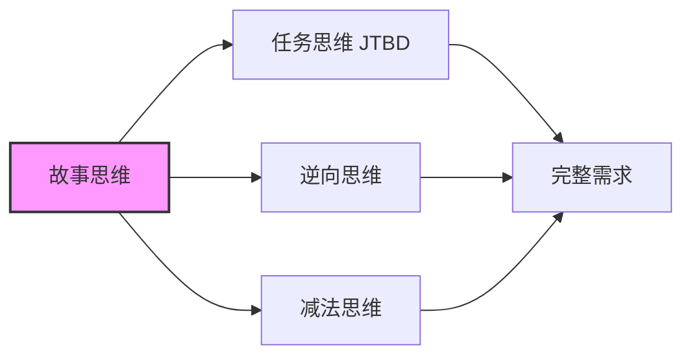

# 2.4 故事思维：把用户当作故事的主角

在前面的章节中，我们学会了用「任务视角」思考需求，用「逆向思维」识别风险，用「减法思维」聚焦核心。

现在，我们要学习一个让这些工具更有力量的方法：**把用户当作故事的主角**。

## 经过本节学习，你将掌握

- 理解为什么「讲故事」比「列功能」更有效
- 学会用「三维构建法」创建立体的用户画像
- 掌握「用户旅程地图」这个可视化工具
- 获得可直接复制的「故事化 Prompt」模板

## 本节核心洞见

> "如果你想让人们记住什么，就把它变成一个故事。"
> —— Tim Brown，IDEO 设计公司 CEO

斯坦福大学的研究表明：当信息以故事形式呈现时，人们的记忆留存率是纯数据的 22 倍。

这意味着什么？

- 当你对 AI 说「做一个待办清单」，AI 只能猜测你想要什么
- 当你讲述「我是一个每天处理 10 件事的职场人，总怕遗漏重要事项」，AI 能精准理解你的需求

**故事不是修辞技巧，而是最高效的沟通方式。**

## 故事思维与其他工具的关系

你可能会问：故事思维和前面学的工具有什么区别？

简单说：

| 思维工具 | 回答的核心问题 |
|---------|--------------|
| 任务思维 | 用户要完成什么任务？ |
| 逆向思维 | 什么会导致失败？ |
| 减法思维 | 什么功能可以不做？ |
| **故事思维** | **用户是谁？他经历了什么？** |

故事思维是其他工具的「底座」。当你真正理解用户是谁、经历了什么，任务、风险、优先级都会变得更清晰。

## 这不只是「做产品」的事

和前面的章节一样，故事思维适用于你想用 AI 做的任何事情：

| 你想做的事情 | 故事思维帮你解决的问题 |
|-------------|---------------------|
| 做一个小工具 | 让你从「我想要什么功能」转向「我的用户经历了什么」 |
| 数据分析报告 | 帮你理解「老板看这份报告时在想什么」 |
| 自动化脚本 | 让你看清「这个重复劳动背后的完整场景」 |
| 给家人做工具 | 帮你站在「60 岁父母的视角」思考问题 |

无论你的目标是什么，故事思维都能帮你更深入地理解「为谁而做」。

## 本节结构

接下来，我们将通过以下内容，帮你掌握故事思维：

1. **产品即故事**：理解故事的基本结构，学会用故事视角描述需求
2. **三维用户画像**：超越「年龄职业」，构建有血有肉的用户形象
3. **用户旅程地图**：把故事可视化，找到最重要的痛点
4. **故事化 Prompt**：用故事思维写出更精准的 AI 指令
5. **实战练习**：为你自己的项目应用故事思维
6. **核心要点**：带走可以立即应用的原则

准备好了吗？让我们从「什么是好故事」开始。
