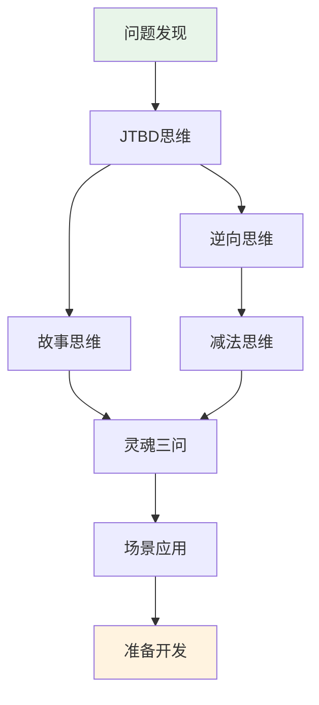

# 2.8 本章总结：产品经理的思维工具箱

经过本节学习，你将掌握：
- 七个思维模型之间的协同关系
- 从"有个想法"到"准备开发"的完整思考流程
- 一个可反复使用的项目启动决策框架

## 七大模型不是孤立的工具

在前面的章节中，你学习了七个思维模型。但它们不是七个独立的工具，而是一个**完整的思考链条**。

| 阶段 | 使用的模型 | 核心问题 |
|-----|-----------|---------|
| **发现阶段** | 问题发现 | 什么问题值得解决？ |
| **定义阶段** | JTBD思维 | 用户要完成什么任务？ |
| **规避阶段** | 逆向思维 | 什么会导致失败？ |
| **聚焦阶段** | 减法思维 | 第一版只做什么？ |
| **理解阶段** | 故事思维 | 用户经历了什么？ |
| **验证阶段** | 灵魂三问 | 我想清楚了吗？ |
| **适配阶段** | 场景应用 | 这个场景有什么特殊要求？ |

## 思维模型的使用顺序

### 第一步：从问题开始，不是从功能开始

很多人的起点是"我想做一个xxx"。但正确的起点是"我发现了一个问题"。

**问题发现**帮你识别值得解决的问题。**JTBD思维**帮你理解用户真正要完成的任务，而不是你想象中的功能列表。

### 第二步：先想失败，再想成功

有了清晰的任务定义后，不要急着规划功能。

**逆向思维**让你先列出"什么会导致失败"。这些失败因素会指向一个共同的问题：想做的太多。

**减法思维**帮你砍掉不必要的功能，聚焦到能验证核心假设的最小版本。

### 第三步：理解用户，验证想法

功能范围确定后，你需要确认自己真的理解用户。

**故事思维**让你把用户当作故事的主角，理解他们的处境和情绪。

**灵魂三问**是最后的自检：用户是谁？痛点在哪？为什么选你？

### 第四步：根据场景调整

不同场景有不同的侧重点。

**场景应用**帮你把通用的思维模型适配到具体场景：数据分析、自动化脚本、个人工具、给家人做的工具。

## 贯穿案例：从"想做待办清单"到"准备好开发"

让我们用小李的待办清单项目，完整演示如何串联使用七个模型。

### Step 1：问题发现

小李是一名职场新人。他发现自己经常遗漏重要的事情，被领导批评了好几次。

他用"烦恼日记"记录了一周：

| 日期 | 烦恼瞬间 | 频率 | 痛苦程度 |
|-----|---------|-----|---------|
| 周一 | 忘了给客户回邮件 | 每周2-3次 | 8分 |
| 周三 | 会议时间记错了 | 每月1-2次 | 6分 |
| 周五 | 周报忘了写 | 每周1次 | 7分 |

用五维评分法评估"遗漏任务"这个问题：
- 重复性：5分（几乎每天都有）
- 规则性：4分（可以用清单解决）
- 可验证性：5分（自己用就能验证）
- 敏感性：5分（不涉及隐私和资金）
- 容错性：4分（错了可以调整）

**总分：23分，适合用Vibe Coding解决。**

### Step 2：JTBD思维

小李问自己：我真正要完成的任务是什么？

用JTBD模板描述：

> 当我每天开始工作时，我想快速记录今天要做的事，这样我就不会遗漏重要任务，可以安心投入工作。

任务的三个层次：
- **功能任务**：记录和查看待办事项
- **情感任务**：减少焦虑，感到安心
- **社会任务**：在领导和同事面前显得靠谱

### Step 3：逆向思维

小李做了一个Pre-mortem分析：假设三个月后项目失败了，可能是什么原因？

| 失败原因 | 可能性 | 严重性 | 预防措施 |
|---------|-------|-------|---------|
| 功能太多，做不完 | 高 | 高 | 第一版只做3个核心功能 |
| 用起来比便签还麻烦 | 中 | 高 | 添加任务必须在3秒内完成 |
| 做完了自己都不用 | 中 | 高 | 先用一周纸质清单验证习惯 |
| 需要打开电脑才能用 | 低 | 中 | 先做网页版，手机也能访问 |

### Step 4：减法思维

基于Pre-mortem的分析，小李明确了MVP范围：

**核心假设**：一个极简的每日待办清单，比便签纸和手机备忘录更好用。

**验证标准**：自己连续使用7天，每天都用它记录和完成任务。

**P0功能**（必须有）：
1. 添加任务
2. 完成任务（打勾）
3. 查看今日任务

**不做清单**：
- 不做分类标签
- 不做截止日期
- 不做提醒通知
- 不做历史统计

### Step 5：故事思维

小李用三维画像描述自己（作为用户）：

| 维度 | 内容 |
|-----|------|
| **表面属性** | 25岁，职场新人，每天处理10-15件大小事务 |
| **行为习惯** | 早上到公司第一件事是看邮件，用手机备忘录记事但经常忘记看 |
| **深层动机** | 害怕遗漏任务被领导批评，想成为一个靠谱的人 |

用户旅程的关键触点：
- 早上到公司，打开电脑
- 突然想起一件事，需要快速记下来
- 下班前，检查今天的事情是否都完成了

### Step 6：灵魂三问

最后的自检：

| 问题 | 回答 | 状态 |
|-----|------|------|
| 用户是谁？ | 我自己——一个怕遗漏任务的职场新人 | 🟢 清晰 |
| 痛点在哪？ | 经常忘事，被批评，感到焦虑 | 🟢 清晰 |
| 为什么选我？ | 现有工具要么太复杂，要么容易忘记看；我要做一个打开就是今日待办的极简工具 | 🟢 清晰 |

**三个绿灯，可以开始开发了。**

## 模型选择速查表

不知道该用哪个模型？参考这张表：

| 你的困惑 | 推荐使用的模型 | 核心问题 |
|---------|--------------|---------|
| 不知道做什么项目 | 问题发现 | 我的生活中有什么重复出现的烦恼？ |
| 想做的功能太多 | 减法思维 | 第一版必须验证的假设是什么？ |
| 不确定用户是否需要 | JTBD思维 | 用户要完成什么任务？现在怎么解决的？ |
| 担心做出来没人用 | 逆向思维 | 什么情况下会失败？如何避免？ |
| 不知道用户长什么样 | 故事思维 | 用户在什么场景下、带着什么情绪使用？ |
| 不知道是否准备好了 | 灵魂三问 | 用户是谁？痛点在哪？为什么选我？ |
| 场景特殊，不知道怎么调整 | 场景应用 | 这个场景的核心约束是什么？ |

## 本节要点

✓ **七个模型是一个思考链条**：问题发现→JTBD→逆向→减法→故事→灵魂三问→场景应用，每个环节解决不同的问题。

✓ **不需要每次都走完整流程**：简单项目可以跳过部分步骤，但灵魂三问是最后的底线检查。

✓ **模型的价值在于整合使用**：孤立使用任何一个模型都不够，串联起来才能形成完整的思考。

接下来，我们会提供一份可以直接使用的开发前检查清单，帮你快速判断是否准备好开始开发。
