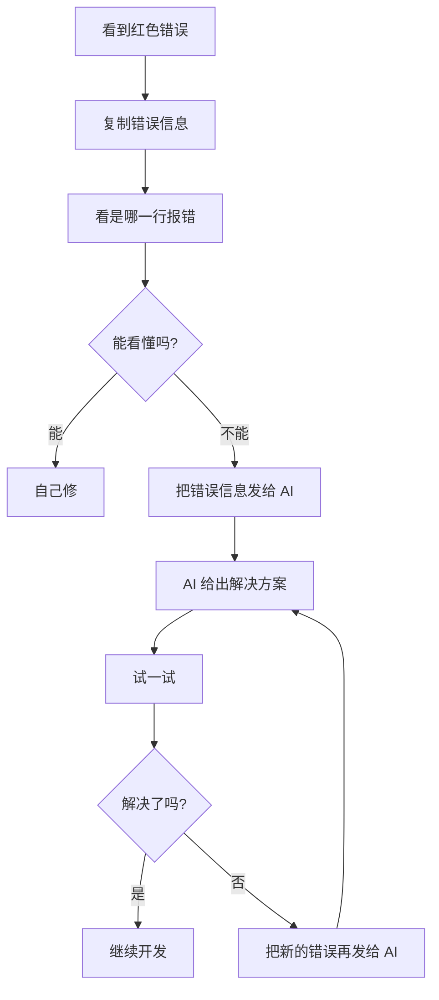

# B.1 JavaScript 错误

遇到错误别慌！这一节列出了最常见的 JavaScript 错误，以及对应的解决方法。遇到问题时，直接查表就行。


## undefined 错误

**错误信息**：
```
Uncaught TypeError: Cannot read properties of undefined (reading 'xxx')
```

**通俗解释**：你在试图使用一个「不存在」的东西。就像你问「小明的手机号」，但小明这个人不存在。

**常见原因**：
| 原因 | 示例代码 | 修复方法 |
|------|----------|----------|
| 变量没有赋值 | `let user; console.log(user.name)` | 先检查变量是否有值 |
| 数组越界 | `arr[10]` 但数组只有 3 个元素 | 检查数组长度 |
| 对象属性拼写错误 | `user.nmae`（应该是 `name`） | 检查属性名拼写 |
| 函数没有返回值 | `function get() {}` 然后用返回值 | 确保函数有 `return` |

**快速修复 Prompt**：
```markdown
我的代码报错：Cannot read properties of undefined (reading 'xxx')

错误出现在这行：[粘贴报错的那行代码]

请帮我分析原因并修复。
```


## null 错误

**错误信息**：
```
Uncaught TypeError: Cannot read properties of null (reading 'xxx')
```

**通俗解释**：你在试图使用一个「明确是空」的东西。就像一个空盒子，你却想从里面拿东西。

**常见原因**：
| 原因 | 示例代码 | 修复方法 |
|------|----------|----------|
| DOM 元素没找到 | `document.getElementById('btn')` 返回 null | 检查 ID 是否正确，或元素是否存在 |
| API 返回 null | 后端返回了 `null` | 添加空值判断 |
| LocalStorage 没数据 | `JSON.parse(localStorage.getItem('data'))` | 添加默认值：`|| []` |

**快速修复 Prompt**：
```markdown
我的代码报错：Cannot read properties of null

我想获取页面上 ID 为 [xxx] 的元素，但返回了 null。

请帮我检查可能的原因。
```


## TypeError

**错误信息**：
```
Uncaught TypeError: xxx is not a function
```

**通俗解释**：你把一个不是函数的东西当函数用了。就像你对着一块石头说「给我唱首歌」。

**常见原因**：
| 原因 | 示例代码 | 修复方法 |
|------|----------|----------|
| 变量名覆盖了函数名 | 定义了 `let alert = 'hi'`，然后 `alert('hello')` | 避免用内置函数名作变量名 |
| 方法名拼写错误 | `arr.pushs(1)`（应该是 `push`） | 检查方法名拼写 |
| 调用了不存在的方法 | 对数字调用字符串方法 | 检查数据类型 |


## ReferenceError

**错误信息**：
```
Uncaught ReferenceError: xxx is not defined
```

**通俗解释**：你用了一个根本没有定义过的变量。就像你说「请把 xxx 递给我」，但屋子里根本没有这个东西。

**常见原因**：
| 原因 | 示例代码 | 修复方法 |
|------|----------|----------|
| 变量名拼写错误 | `consle.log`（应该是 `console`） | 检查拼写 |
| 变量作用域问题 | 在函数外访问函数内的变量 | 理解作用域，或把变量定义在外面 |
| 忘记引入库 | 使用了 jQuery 但没引入 | 确保依赖已加载 |


## SyntaxError

**错误信息**：
```
Uncaught SyntaxError: Unexpected token 'xxx'
```

**通俗解释**：代码的「语法」写错了。就像中文里少了标点符号，句子读不通。

**常见原因**：
| 原因 | 示例代码 | 修复方法 |
|------|----------|----------|
| 少了括号 | `if (x > 1 {` | 补上缺少的括号 |
| 多了逗号 | `[1, 2, 3,]`（某些情况） | 删掉多余的逗号 |
| 引号不匹配 | `'hello"` | 使用配对的引号 |
| JSON 格式错误 | `{name: 'test'}` 应该是 `{"name": "test"}` | JSON 的 key 必须用双引号 |

::: tip 语法错误的特点
语法错误通常在代码运行前就会报错，而且浏览器会告诉你在哪一行。仔细看那一行和它的上一行，问题通常就在那附近。
:::


## 错误排查通用流程



记住：**报错不可怕，复制粘贴给 AI 就行**。
