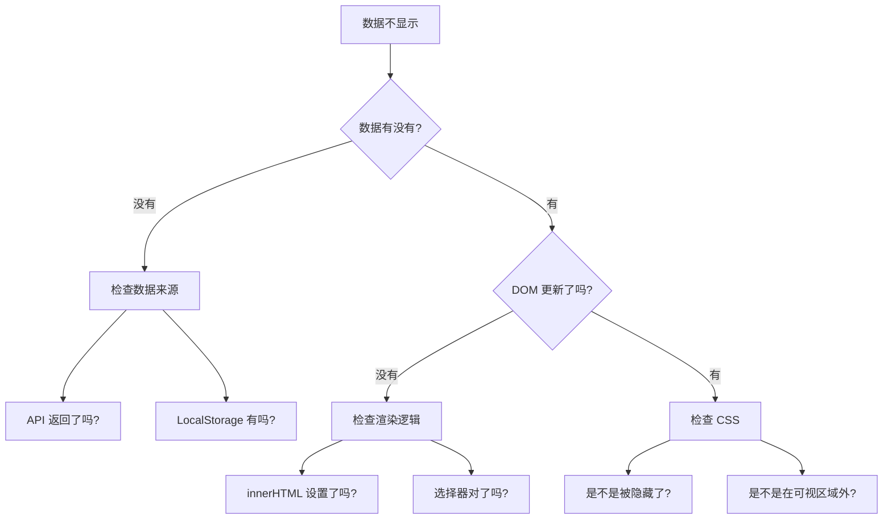

# B.3 交互问题

页面能显示，但点击、输入等交互没反应？这一节帮你解决最常见的交互问题。


## 按钮无反应

**现象**：点击按钮后，什么都没发生。

**排查清单**：

| 检查项 | 怎么检查 | 解决方法 |
|--------|----------|----------|
| 事件没绑定 | 检查 HTML 中的 `onclick` 或 JS 中的 `addEventListener` | 确保事件处理函数正确绑定 |
| 函数名写错 | 检查 `onclick="xxx()"` 中的函数名 | 确保和 JS 中定义的函数名一致 |
| JS 文件没加载 | 看控制台有没有 404 错误 | 检查 `<script>` 标签路径 |
| JS 有语法错误 | 看控制台有没有红色错误 | 修复语法错误后，后面的代码才会执行 |
| 被其他元素遮挡 | 检查按钮上方有没有透明元素 | 调整 `z-index` 或移除遮挡元素 |

**快速修复 Prompt**：
```markdown
我的按钮点击没反应。

HTML 按钮代码：
[粘贴按钮代码]

JS 函数代码：
[粘贴对应的 JS 代码]

控制台错误信息（如果有）：
[粘贴错误信息]

请帮我排查原因。
```


## 表单提交失败

**现象**：填完表单点提交，页面刷新了但数据没处理。

**常见原因与解决**：

### 页面刷新问题
```javascript
// 问题：表单提交后页面刷新了
// 解决：阻止默认行为
form.addEventListener('submit', function(e) {
  e.preventDefault();  // 阻止默认的表单提交
  // 然后在这里处理数据
});
```

### 获取不到输入值
```javascript
// 问题：获取的值是空的
// 检查 1：选择器是否正确
const input = document.getElementById('username');  // ID 要对应

// 检查 2：获取值的方式
const value = input.value;  // 注意是 .value 不是 .innerText

// 检查 3：获取时机是否正确（要在用户输入后获取）
```

### 数据格式问题
```javascript
// 问题：数字被当成字符串
const age = document.getElementById('age').value;  // "25"（字符串）
const ageNumber = parseInt(age);  // 25（数字）

// 或者用 Number()
const ageNumber2 = Number(age);
```


## 数据不显示

**现象**：数据存了，但页面上看不到。

**排查步骤**：



**常见修复代码**：

```javascript
// 检查数据是否存在
const data = localStorage.getItem('quotes');
console.log('存储的数据:', data);  // 用 console.log 检查

// 确保解析正确
const quotes = JSON.parse(data) || [];
console.log('解析后的数组:', quotes);

// 确保渲染到正确位置
const container = document.getElementById('list');
if (container) {
  container.innerHTML = quotes.map(q => `<p>${q}</p>`).join('');
} else {
  console.log('找不到容器元素！');
}
```


## 数据存了但刷新后没了

**现象**：数据操作成功了，但刷新页面后数据消失。

**排查清单**：

| 可能原因 | 检查方法 | 解决方法 |
|----------|----------|----------|
| 没有持久化存储 | 检查有没有用 LocalStorage | 数据变化时保存到 LocalStorage |
| 存储时机不对 | 检查保存代码是否执行 | 在数据变化后立即保存 |
| 加载时机不对 | 检查页面加载时是否读取数据 | 在页面加载时从 LocalStorage 读取 |
| 存储格式问题 | 检查存储的数据格式 | 用 JSON.stringify 存，JSON.parse 取 |

**完整的存取示例**：
```javascript
// 保存数据
function saveQuotes(quotes) {
  localStorage.setItem('quotes', JSON.stringify(quotes));
}

// 读取数据
function loadQuotes() {
  const data = localStorage.getItem('quotes');
  return data ? JSON.parse(data) : [];
}

// 页面加载时读取
document.addEventListener('DOMContentLoaded', function() {
  const quotes = loadQuotes();
  renderQuotes(quotes);
});

// 添加新数据时保存
function addQuote(newQuote) {
  const quotes = loadQuotes();
  quotes.push(newQuote);
  saveQuotes(quotes);  // 别忘了保存！
  renderQuotes(quotes);
}
```


## 交互问题通用排查口诀

> **看控制台** → **加 console.log** → **检查时机** → **问 AI**

1. **看控制台**：有红色错误吗？
2. **加 console.log**：代码执行到哪一步了？数据是什么？
3. **检查时机**：代码是在正确的时间执行吗？
4. **问 AI**：把相关代码和现象描述清楚
