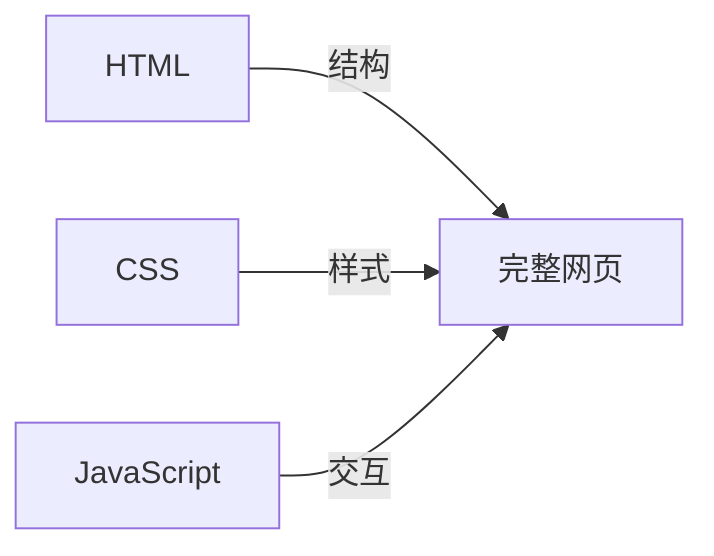

# C.3 技术相关

这些是做网页/应用时会遇到的技术术语。


## HTML

**全称**：HyperText Markup Language（超文本标记语言）

**一句话解释**：定义网页「有什么内容」。

**类比**：就像房子的结构——哪里是客厅、哪里是卧室、哪里是厨房。

**长什么样**：
```html
<h1>这是标题</h1>
<p>这是一段文字</p>
<button>这是按钮</button>
```


## CSS

**全称**：Cascading Style Sheets（层叠样式表）

**一句话解释**：定义网页「长什么样」。

**类比**：就像房子的装修——墙壁什么颜色、沙发多大、灯放在哪。

**长什么样**：
```css
h1 {
  color: blue;      /* 字体颜色 */
  font-size: 24px;  /* 字体大小 */
}
```


## JavaScript

**简称**：JS

**一句话解释**：让网页「能动」，有交互。

**类比**：就像房子里的电器和开关——点开关灯会亮，按按钮电视会开。

**长什么样**：
```javascript
// 点击按钮后弹出提示
button.onclick = function() {
  alert('你点击了按钮！');
}
```


## HTML + CSS + JS 的关系



| 技术 | 负责 | 类比 |
|------|------|------|
| HTML | 内容结构 | 房子的框架 |
| CSS | 外观样式 | 房子的装修 |
| JavaScript | 行为交互 | 房子的电器 |


## LocalStorage

**一句话解释**：浏览器提供的本地存储空间，数据保存在用户电脑上。

**类比**：就像你房间里的抽屉，东西放进去，关了门下次开门还在。

**特点**：
- 只存在用户自己的浏览器里
- 刷新页面、关闭浏览器数据都还在
- 换个浏览器或电脑数据就没了
- 适合存简单的用户偏好、记录等

**使用示例**：
```javascript
// 存数据
localStorage.setItem('name', '小明');

// 取数据
const name = localStorage.getItem('name');  // '小明'

// 删数据
localStorage.removeItem('name');
```


## JSON

**全称**：JavaScript Object Notation

**一句话解释**：一种数据格式，用来存储和传输数据。

**类比**：就像一种通用的「表格格式」，大家都能看懂。

**长什么样**：
```json
{
  "name": "小明",
  "age": 25,
  "hobbies": ["读书", "跑步", "编程"]
}
```

**常见用途**：
- API 返回的数据
- 配置文件
- LocalStorage 存储复杂数据


## 环境变量

**一句话解释**：存放敏感信息（如密钥、密码）的地方，不会被写进代码里。

**类比**：就像保险箱。密码放在保险箱里，而不是贴在门上。

**为什么重要**：
- 密钥写在代码里，一旦代码公开，密钥就泄露了
- 环境变量不会被上传到 GitHub
- 是安全的最佳实践

**通常的用法**：
1. 创建 `.env` 文件存放敏感信息
2. 代码中通过 `process.env.XXX` 读取
3. `.env` 文件加入 `.gitignore`，不上传


## 域名

**一句话解释**：网站的地址，让人能找到你的网站。

**类比**：就像你家的门牌号。有了地址，别人才能找到你家。

**结构**：
```
https://www.example.com/about
  │       │      │      │
协议    子域名  主域名  路径
```

**获取域名**：
- 去域名注册商（如阿里云、腾讯云）购买
- 连接到你的部署平台


## 响应式设计

**一句话解释**：让网页在不同尺寸的屏幕上都能正常显示。

**类比**：就像水，能适应不同形状的容器。

**实现方式**：
- 使用百分比而不是固定像素
- 使用媒体查询针对不同屏幕写样式
- 使用 Flexbox/Grid 布局

**为什么重要**：
现在人们用手机、平板、电脑访问网站，响应式设计让所有用户都有好的体验。
