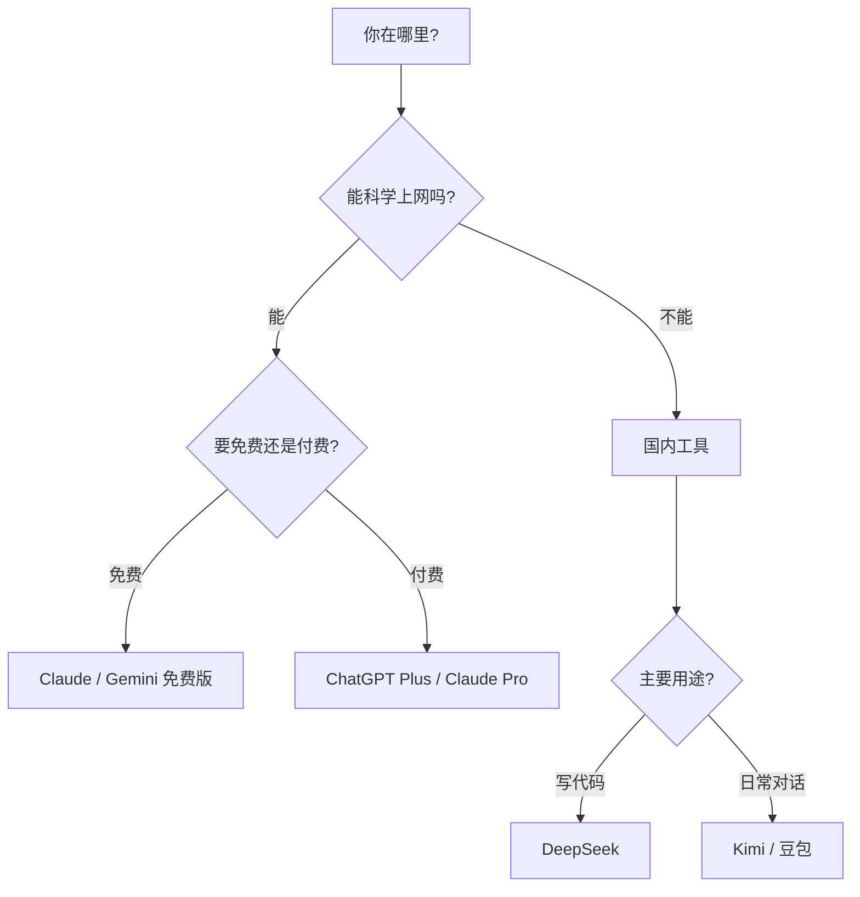

# D.1 对话式 AI 对比

对话式 AI 是最简单的 AI 编程方式：直接对话，让 AI 帮你写代码。以下是主流工具的对比。

## 综合对比表

| 工具 | 公司 | 中文支持 | 免费额度 | 代码能力 | 适合人群 |
|------|------|----------|----------|----------|----------|
| **ChatGPT** | OpenAI | 良好 | 有限制 | 优秀 | 通用场景 |
| **Claude** | Anthropic | 优秀 | 有限制 | 优秀 | 长文本/复杂任务 |
| **Gemini** | Google | 良好 | 较多 | 良好 | Google 生态用户 |
| **Kimi** | 月之暗面 | 原生 | 较多 | 良好 | 国内用户 |
| **DeepSeek** | DeepSeek | 原生 | 免费 | 优秀 | 性价比首选 |
| **豆包** | 字节跳动 | 原生 | 免费 | 良好 | 国内新手 |

## 各工具详解

### ChatGPT

**官网**：chat.openai.com

**特点**：
- AI 对话的「开山鼻祖」，生态最丰富
- GPT-4 代码能力非常强
- 插件和 GPTs 扩展功能多

**限制**：
- 需要科学上网
- 免费版功能受限

**适合**：想体验最成熟 AI 能力的用户

### Claude

**官网**：claude.ai

**特点**：
- 超长上下文窗口（可处理很长的代码）
- 推理能力强，适合复杂任务
- 中文理解能力优秀
- 更不容易产生幻觉

**限制**：
- 需要科学上网
- 免费版有对话次数限制

**适合**：处理长代码、复杂逻辑的用户

### Gemini

**官网**：gemini.google.com

**特点**：
- Google 出品，与 Google 服务整合好
- 多模态能力强（可以理解图片）
- 免费额度较多

**限制**：
- 需要科学上网
- 代码能力略逊于 GPT-4 和 Claude

**适合**：使用 Google 生态的用户

### Kimi

**官网**：kimi.moonshot.cn

**特点**：
- 国内可直接访问
- 超长上下文支持
- 中文理解优秀
- 可以读取文件和网页

**限制**：
- 代码能力相对弱一些
- 有使用次数限制

**适合**：国内用户的入门首选

### DeepSeek

**官网**：chat.deepseek.com

**特点**：
- 国内可直接访问
- 代码能力非常强（DeepSeek Coder）
- 完全免费使用
- 性价比极高

**限制**：
- 知名度相对较低
- 生态不如 ChatGPT 丰富

**适合**：想要高质量免费工具的用户，强烈推荐

### 豆包

**官网**：www.doubao.com

**特点**：
- 字节跳动出品
- 国内可直接访问
- 界面友好，上手简单
- 免费使用

**限制**：
- 代码能力一般
- 更适合日常对话

**适合**：国内完全零基础的新手

## 选择建议

## 快速推荐

| 你的情况 | 推荐工具 |
|----------|----------|
| 国内用户，想写代码 | DeepSeek |
| 国内用户，入门体验 | Kimi |
| 能科学上网，追求最强 | Claude / ChatGPT |
| 能科学上网，想免费用 | Gemini |

::: tip 建议
不用纠结选哪个，**先用起来**最重要。等你熟悉了，再根据需要切换工具。
:::
