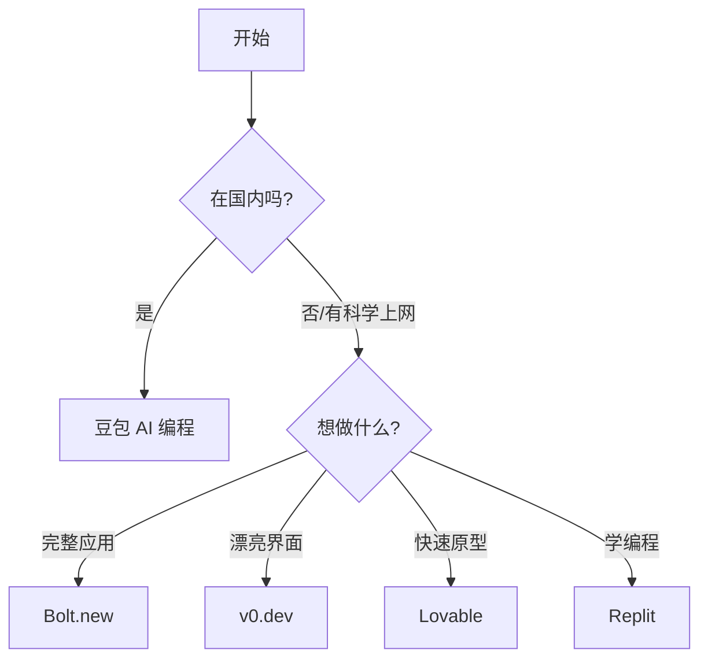

# D.3 专用 AI IDE 对比

专用 AI IDE 是为「不懂代码的人」设计的。在网页上描述你想要什么，AI 直接给你做出来。这是零基础最友好的方式。

## 综合对比表

| 工具 | 特点 | 价格 | 优势 | 适合 |
|------|------|------|------|------|
| **Bolt.new** | 全栈应用生成 | 免费版可用 | 功能最全面 | 想做完整应用 |
| **豆包 AI 编程** | 代码生成+预览 | 免费 | 国内访问流畅 | 国内用户首选 |
| **v0.dev** | UI 组件生成 | 免费版可用 | UI 设计感强 | 想做漂亮界面 |
| **Lovable** | 产品原型 | 免费版可用 | 上手简单 | 快速验证想法 |
| **Replit Agent** | 在线 IDE + AI | 免费版可用 | 一站式体验 | 想学编程的新手 |

## 各工具详解

### Bolt.new

**官网**：bolt.new

**是什么**：StackBlitz 推出的 AI 全栈开发平台，可以用自然语言做出完整应用。

**核心功能**：
- 描述需求，生成完整项目
- 支持前端 + 后端 + 数据库
- 实时预览效果
- 一键部署

**价格**：
- 免费版：有使用限制
- 付费版：$20/月起

**优点**：
- 能做的东西最复杂
- 生成的代码质量高
- 可以继续迭代修改

**缺点**：
- 免费额度较少
- 国内访问较慢，需要科学上网
- 复杂需求有时需要多轮调整

**适合**：想做完整应用的用户（海外或有科学上网条件的用户）

### 豆包 AI 编程

**官网**：[doubao.com/chat/coding](https://www.doubao.com/chat/coding)

**是什么**：字节跳动推出的 AI 编程助手，支持代码生成和实时预览，是国内用户的理想选择。

**核心功能**：
- 自然语言描述需求，生成代码
- HTML/CSS/JavaScript 实时预览
- 代码解释、修复和优化
- 支持上传代码文件或引入 GitHub 项目

**价格**：
- 免费使用

**优点**：
- 国内访问流畅，无需科学上网
- 界面简洁，上手容易
- 支持中文交互，理解更准确
- 免费无限制

**缺点**：
- 功能相比 Bolt.new 略简单
- 部署功能不如 Bolt.new 完善

**适合**：国内用户、想快速体验 AI 编程的初学者

### v0.dev

**官网**：v0.dev

**是什么**：Vercel 推出的 AI UI 生成工具，专注于做漂亮的界面。

**核心功能**：
- 描述需求，生成 UI 组件
- 基于 React + Tailwind CSS
- 可以直接复制代码
- 支持迭代修改

**价格**：
- 免费版：每月有限次数
- Pro：$20/月

**优点**：
- UI 设计感非常好
- 生成的组件可以直接用
- 和 Vercel 部署无缝对接

**缺点**：
- 只能做 UI，不能做后端逻辑
- 需要了解 React 才能充分利用

**适合**：想快速做出漂亮界面的用户

### Lovable

**官网**：lovable.dev

**是什么**：专注于帮你快速做出产品原型的 AI 工具。

**核心功能**：
- 自然语言生成应用
- 简洁直观的界面
- 支持实时预览
- 可以部署分享

**价格**：
- 免费版可用
- 付费版功能更多

**优点**：
- 上手最简单
- 非常适合验证想法
- 界面友好

**缺点**：
- 功能相对简单
- 复杂应用可能力不从心

**适合**：想快速验证想法的用户

### Replit Agent

**官网**：replit.com

**是什么**：Replit 是在线 IDE，Agent 是其 AI 助手，可以帮你从零做出应用。

**核心功能**：
- 在线编写和运行代码
- AI 帮你生成代码
- 支持多种编程语言
- 可以直接部署

**价格**：
- 免费版：基础功能
- Replit Core：$20/月

**优点**：
- 一站式体验（写代码 + 运行 + 部署）
- 学习编程的好地方
- 社区活跃，有很多模板

**缺点**：
- AI 能力不如专门的 AI 工具
- 免费版有资源限制

**适合**：想在学习编程的同时使用 AI 的用户

## 选择建议

| 情况 | 推荐工具 |
|----------|----------|
| 国内用户，想快速上手 | 豆包 AI 编程 |
| 做一个完整的小应用 | Bolt.new |
| 做漂亮的网页界面 | v0.dev |
| 快速验证一个想法 | Lovable |
| 边学编程边做东西 | Replit |

## 本教程推荐

**国内用户推荐从豆包 AI 编程开始**，访问流畅、免费、支持实时预览。

**海外或有科学上网条件的用户推荐 Bolt.new**，功能最全面。

选择理由：
1. 功能全面，能做出「有用」的东西
2. 不需要任何编程知识
3. 界面直观，上手简单
4. 生成的代码质量不错，以后想学代码也有参考

::: tip 记住
工具只是工具。重要的是你想做什么、解决什么问题。选一个顺手的，先用起来！
:::
