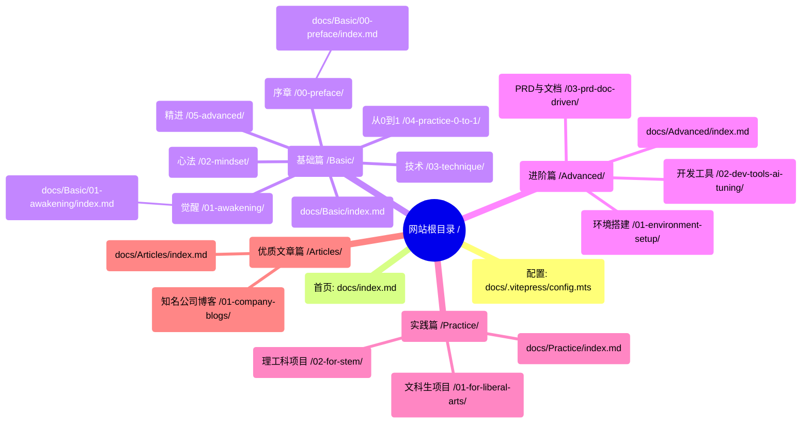

# 网站页面与文件对应关系图

## 1. 核心结构概览 (Mermaid)

该图展示了网站导航结构与文件系统的对应关系。

## 2. 详细文件映射表

此表列出了网站导航栏中的主要链接及其对应的源文件路径。**修改对应文件即可更新网页内容。**

| 导航分类 | 页面名称 | URL 路径 | 源文件路径 (相对于项目根目录) |
| :--- | :--- | :--- | :--- |
| **首页** | 首页 | `/` | `docs/index.md` |
| **基础篇** | 导览 | `/Basic/` | `docs/Basic/index.md` |
| | 0. 序章 | `/Basic/00-preface/` | `docs/Basic/00-preface/index.md` |
| | 1. 觉醒：从码农到指挥官 | `/Basic/01-awakening/` | `docs/Basic/01-awakening/index.md` |
| | 2. 心法：核心思维 | `/Basic/02-mindset/` | `docs/Basic/02-mindset/index.md` |
| | 3. 技术：从想法到产品 | `/Basic/03-technique/` | `docs/Basic/03-technique/index.md` |
| | 4. 从 0 到 1 实战 | `/Basic/04-practice-0-to-1/` | `docs/Basic/04-practice-0-to-1/index.md` |
| | 5. 精进技能 | `/Basic/05-advanced/` | `docs/Basic/05-advanced/index.md` |
| | 附录 | `/Basic/99-appendix/` | `docs/Basic/99-appendix/index.md` |
| | 结语 | `/Basic/100-epilogue/` | `docs/Basic/100-epilogue/index.md` |
| | 下部预告 | `/Basic/101-next-part/` | `docs/Basic/101-next-part/index.md` |
| **进阶篇** | 导览 | `/Advanced/` | `docs/Advanced/index.md` |
| | 进阶版（旧） | `/Advanced-old/` | `docs/Advanced-old/index.md` |
| | 第一章：环境搭建 | `/Advanced/01-environment-setup/` | `docs/Advanced/01-environment-setup/index.md` |
| | 第二章：开发工具 | `/Advanced/02-dev-tools-ai-tuning/` | `docs/Advanced/02-dev-tools-ai-tuning/index.md` |
| | 第三章：PRD 与文档 | `/Advanced/03-prd-doc-driven/` | `docs/Advanced/03-prd-doc-driven/index.md` |
| | 第四章：运行与构建 | `/Advanced/04-build-and-runtime-modes/` | `docs/Advanced/04-build-and-runtime-modes/index.md` |
| | 第五章：UI/UX | `/Advanced/05-ui-ux/` | `docs/Advanced/05-ui-ux/index.md` |
| | ... (其他章节以此类推) | ... | `docs/Advanced/*/index.md` |
| **实践篇** | 导览 | `/Practice/` | `docs/Practice/index.md` |
| | 文科生/商科生项目 | `/Practice/01-for-liberal-arts/` | `docs/Practice/01-for-liberal-arts/index.md` |
| | 理工科学生项目 | `/Practice/02-for-stem/` | `docs/Practice/02-for-stem/index.md` |
| | 职场人士项目 | `/Practice/03-for-professionals/` | `docs/Practice/03-for-professionals/index.md` |
| | 核心技能 | `/Practice/10-core-skills/` | `docs/Practice/10-core-skills/index.md` |
| | AI Agent 开发 | `/Practice/11-ai-agents/` | `docs/Practice/11-ai-agents/index.md` |
| | 全栈项目实战 | `/Practice/12-fullstack-projects/` | `docs/Practice/12-fullstack-projects/index.md` |
| | 工具与效率 | `/Practice/13-tools-integration/` | `docs/Practice/13-tools-integration/index.md` |
| **优质文章篇** | 导览 | `/Articles/` | `docs/Articles/index.md` |
| | 知名公司博客 | `/Articles/01-company-blogs/` | `docs/Articles/01-company-blogs/index.md` |
| | 优质播客 | `/Articles/02-podcasts/` | `docs/Articles/02-podcasts/index.md` |
| | 研究报告 | `/Articles/03-research-reports/` | `docs/Articles/03-research-reports/index.md` |
| | 优质 Newsletter | `/Articles/04-newsletters/` | `docs/Articles/04-newsletters/index.md` |
| | 开发者社区 | `/Articles/05-communities/` | `docs/Articles/05-communities/index.md` |

> [!TIP]
> **文件查找技巧**：
>
> 1. 打开 `docs` 目录。
> 2. 根据 URL 的第一段找到对应文件夹（如 `Basic`）。
> 3. 根据 URL 的第二段找到子文件夹（如 `01-awakening`）。
> 4. 编辑该文件夹下的 `index.md` 文件。
